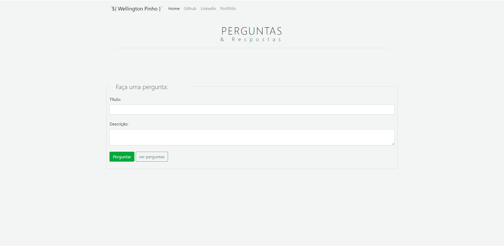
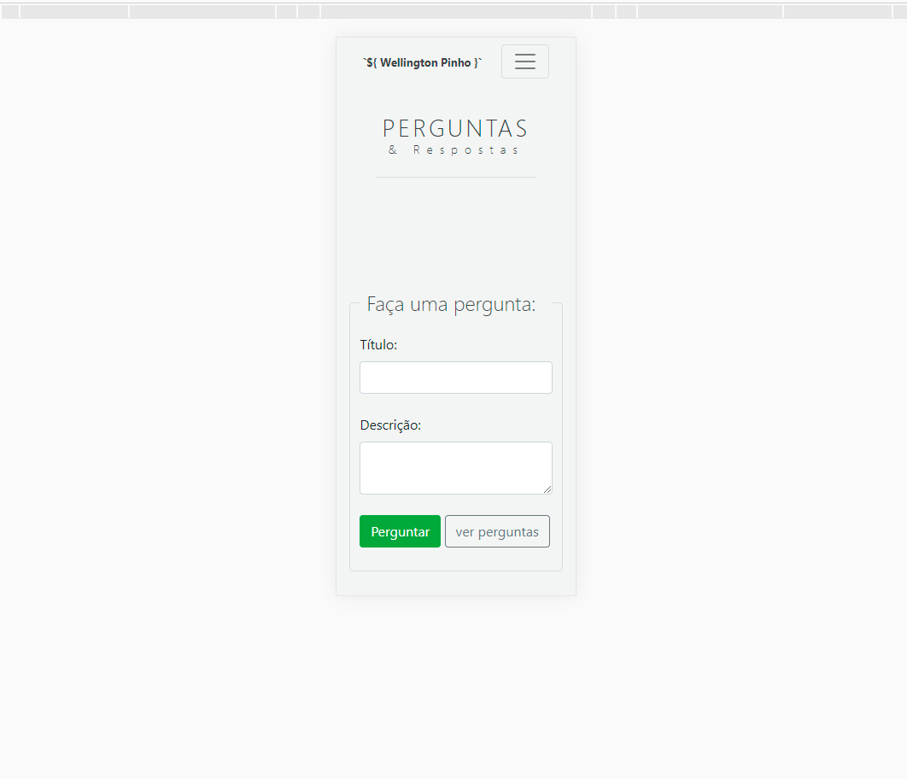
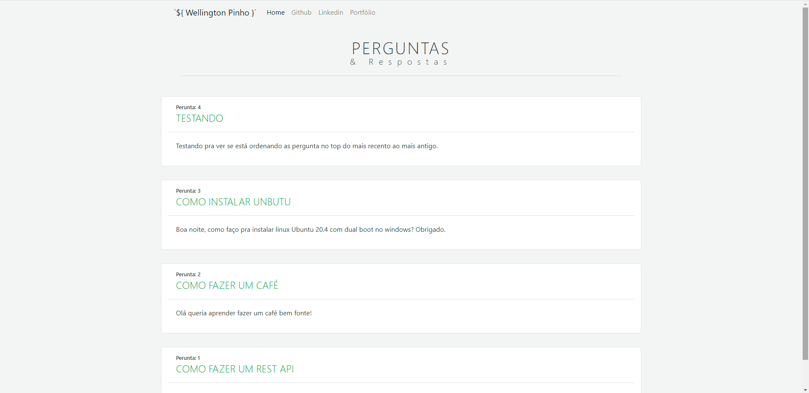

# Node, Express, Sequelize, body-parser, EJS, Cors

Página home


Responsive


Página de perguntas, com as postagens ordenadas


## Iniciando projeto


Este projeto será executado em ** NodeJs ** usando ** Mysql ** como banco de dados. Eu tentei manter a estrutura do código fácil, pois qualquer iniciante também pode adotar o fluxo e começar a construir uma API. O projeto está aberto para sugestões, relatórios de bugs e solicitações de pull.

## Estou aberto para Contrato de Trabalho

Procuro um bom emprego ou contrato de trabalho. Você pode entrar em contato comigo diretamente no meu e-mail ([wellpinho@outlook.com] (mailto: wellpinho@outlook.com "wellpinho@outlook.com")) ou pode baixar meu currículo do meu site [https://wellpinho.com.br] pessoal (https://wellpinho.com.br/).

## Aceito um café

Se você considera meu projeto como algo útil, pode valorizar meu trabalho.

<a href="https://pag.ae/7WrzSVKNN" target="_blank"></a>

## Software Requirements

-   Node.js **12+**
-   Mysql

## Instalação

### Use Git (recomendado)

1.  Clone o projeto do GitHub. Altere "nome-da-pasta" para o nome do seu projeto.

```bash
[git clone https://github.com/wellpinho/perguntas-respostas.git](https://github.com/wellpinho/perguntas-respostas.git)
```

### Agora instale os pacotes

```bash
cd pergunstas-respostas
npm install
```

### Despois de instalado os pacotes

```bash
npm run dev
```

você pode ver se o servidor funcionou olhando no terminal ou cmd ou outro de sua preferência

```bash
Running on port http://localhost:8080

a porta foi configurada para 8080 mas você pode mudar no index.js

CTRL + C para para o processo.
```
**Note:**  Veja se tem a mensagem: Conetado com sucesso! isso indica que esta conectado também ao banco de dados mysql

confira se você criou o banco de dados conforme expecificado no arquivo database.js dentro da pasta utils

### Considerações finais
Espero que este pequeno projeto ajdue iniciantes a criarem seus primeiros crud.
Lembrando que sempre devemos consultar a documentação dos pacotes segue os links:

## Express responsável pelas rotas
[Express JS](http://expressjs.com/pt-br/)

## Sequelize ORM que faz a ponte entre nodejs e o banco de dados Relacional
[Sequelize JS](https://sequelize.org/master/)

## EJS faz a função do front end renderizado no lado do servidor
[EJS](https://ejs.co/)

## O body-parser faz exatamente o que precisamos agora. O body-parser é um módulo capaz de converter o body da requisição para vários formatos. Um desses formatos é json, exatamente o que queremos.
[body-parser](https://www.npmjs.com/package/body-parser)

## Também uso bastante o npm, lá tem o link para baixar os pacotes atualizados e tem também pequenos trechos explicando como usar ou configura o pacote
[npm](https://www.npmjs.com/)

###### UM FORTE ABRAÇO E BONS ESTUDOS!!!

